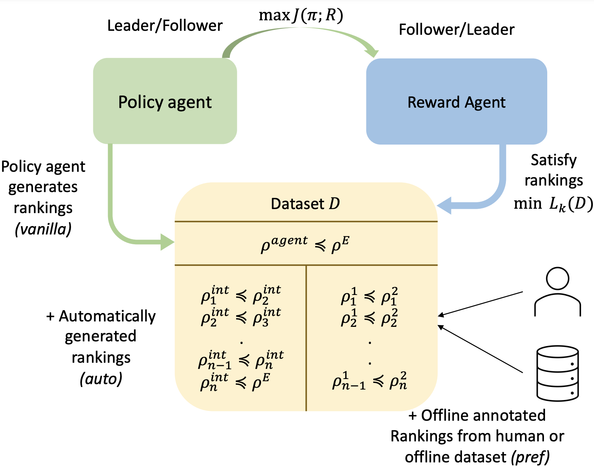

# A Ranking Game for Imitation Learning
<p align="center"> Accepted in Transactions of Machine Learning Research (TMLR) 2023. </p>

<p align="center"> Harshit Sikchi, &nbsp; Akanksha Saran,&nbsp; Wonjoon Goo, &nbsp; Scott Niekum </p>

<p align="center">
   <a href="https://arxiv.org/abs/2202.03481">Paper</a> , &nbsp; <a href="https://hari-sikchi.github.io/rank-game/">Blog Post</a>      
   <br><br><br>
</p>


## Citing
If you find this code useful, please reference in your paper:
```
@article{
anonymous2022a,
title={A Ranking Game for Imitation Learning},
author={Anonymous},
journal={Submitted to Transactions on Machine Learning Research},
year={2022},
url={https://openreview.net/forum?id=d3rHk4VAf0},
note={Under review}
}
```

## Install

### via Conda
```
conda env create -f environment.yml
```
Install D4RL from source here: https://github.com/rail-berkeley/d4rl (In setup.py comment out dm_control)

## Download expert data 
```
Download and extract expert data and preferences data inside the rank-game/expert_data/ folder from this [link](https://drive.google.com/drive/folders/1KJayG61KqiHqtRbxnUrGPBxTX2oDccSn?usp=sharing)
```


## File Structure
- rank-game (Core method)
- - Training code (Online Imitation Learning from Observations): `rank_game_lfo.py`
- - Training code (Online Imitation Learning from Demonstrations): `rank_game_lfd.py`
- - Ranking Loss (PAL/RAL): `reward_agent/ranking_losses.py` 
- - Policy Agent: `policy_agent/sac.py`
- Environments: `envs/`
- Configurations: `configs/`
- Expert Data: `expert_data/` (needs to downloaded from <>)

## Instructions
- All the experiments are to be run under the root folder. 
- Config files  in `configs/` are used to specify hyperparameters for each environment.
- Please keep all the other values in yml files consistent with hyperparamters given in paper to reproduce the results in our paper.


## Running Experiments

### Imitation Learning with rank-game
The following command will reproduce the results in our paper without changing the config:

```
python rank_game_lfo.py --config=<configs/env_name.yml> --seed=<seed>  --exp_name=<experiment name> --obj=<rank-pal-auto/rank-ral-auto> --regularization=${4} --expert_episodes=${5}
python train_loop_sac.py --env=<env_name> --policy=LOOP_SAC_ARC --start_timesteps=<initial exploration steps> --exp_name=<location_to_logs> 
```
Environments wrappers with their termination condition can be found under `envs/`

Note that as indicated in the paper, training the reward function until the cross-validation loss saturates also works well but takes longer to train. Hence, our default configs train the reward function for iterations that scale linearly with the preference dataset size. 
